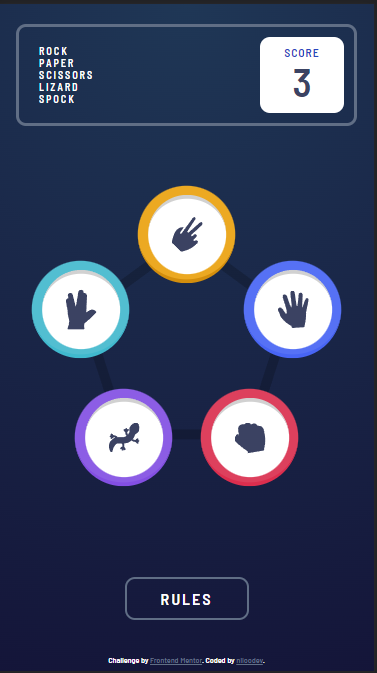
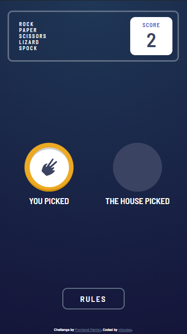
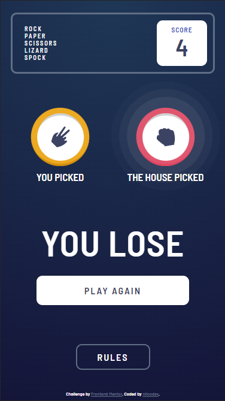
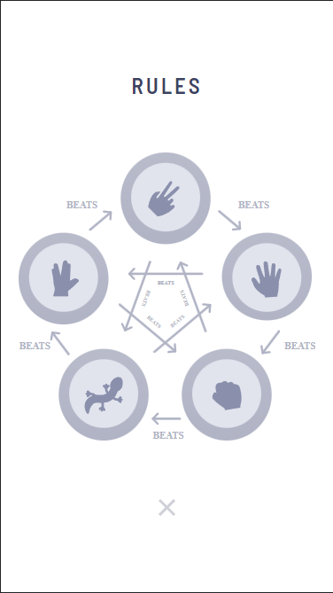
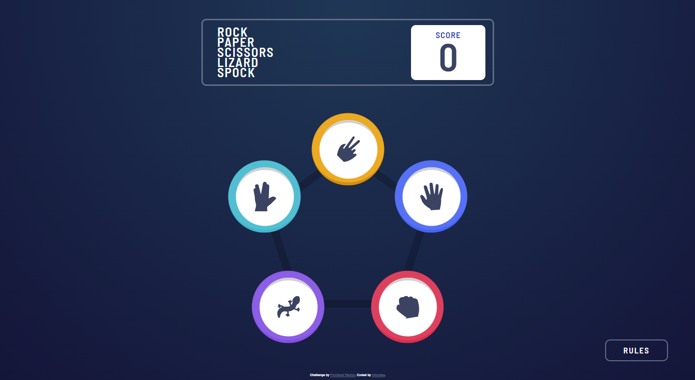
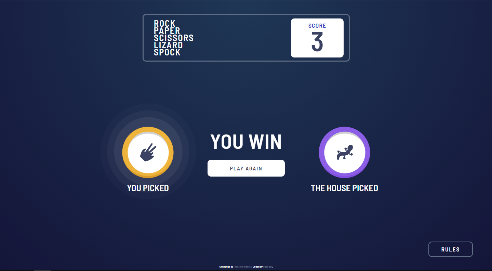
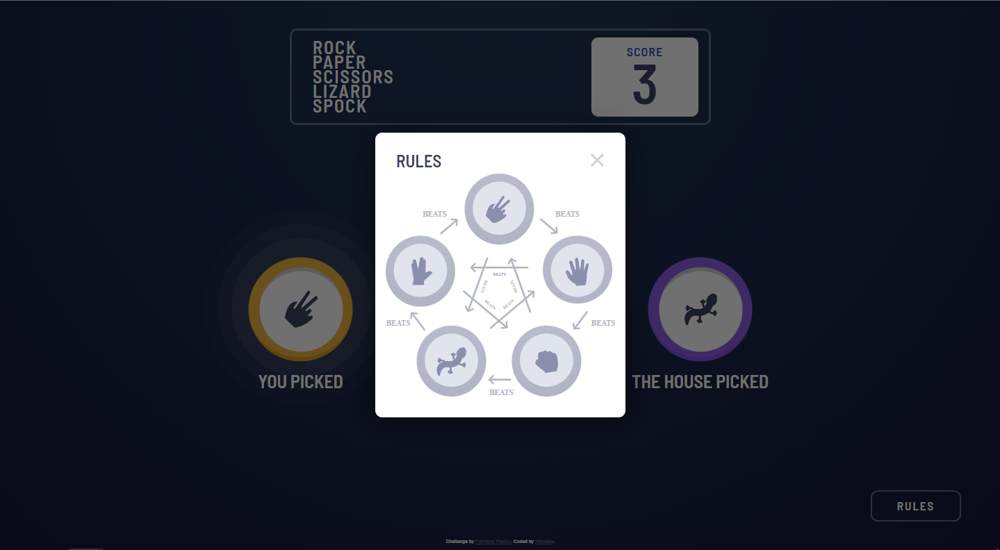

# FRONTEND MENTOR - SOLUÇÃO DO DESAFIO DO PEDRA, PAPEL E TESOURA (BÔNUS)

Essa é uma das soluções para o [Desafio do Pedra, Papel e Tesoura do Frontend Mentor](https://www.frontendmentor.io/challenges/calculator-app-9lteq5N29).
*Eu fiz o desafio no modo bônus, que é basicamente acrescentar "lizard" e "spock" ao jogo - uma referência à Star Trek e um jogo customizado que rola na comunidade nerd desde 1998, criado por Sam Kass, um engenheiro de software.
É possível ver o código em React na pasta "src" e o deploy final da aplicação na pasta "build".

## SUMÁRIO

- [RESUMO](#RESUMO)
  - [DESAFIO](#DESAFIO)
  - [IMAGENS | PRINTS](#PRINTS)
- [PROCESSO](#PROCESSO)
  - [FERRAMENTAS UTILIZADAS](#FERRAMENTAS)
- [AUTOR | CRÉDITOS](#AUTOR)

## RESUMO
Foi um desafio um pouco mais complicado, visto que eu queria animar alguns componentes e manter a dinâmica da página interativa e agradável visualmente. Optei por utilizar React pelas bibliotecas adicionais que ele proporciona e a dinamicidade atráves dos estados dos componentes.

### DESAFIO

Este desafio possui umas especificações um pouco mais exigentes, visto que é bem dinâmico e estrito em suas mecânicas.

Você pode utilizar as ferramentas que quiser para completar o desafio.

Os usuários precisam conseguir:

- Ver os elementos na tela a partir da resolução do dispositivo sem distorções (**responsividade**).
- Escolher e interagir com os componentes do jogo, resultando em uma vitória ou derrota contra um suposto "bot".
- Ser capaz de acessar as regras de forma fácil e simples, sem complicações.
- **Bônus**: Adicionar "spock" e "lizard" ao jogo, como foi o caso.

### PRINTS

### MOBILE

## DESKTOP

## PROCESSO
Eu iniciei o projeto em React e meu primeiro passo foi a construção da base em JSX, separei as variáveis de cor - que o desafio disponibiliza - no meu arquivo "App.css" e deixei o arquivo "index.css" para mudanças mais estruturais; como o tamanho mínimo da página e esse tipo de responsividade, além da definição da fonte.

Depois eu fui gradualmente desenvolvendo o aplicativo, eu dividi em três partes: o cabeçalho, o centro (que engloba a tela de seleção e a tela do jogo em si) e a parte inferior (que em dispositivos mais largos se tornaria absoluto e iria para o canto inferior direito, como pede o desafio em seu design exemplo). Fui desenvolvendo os componentes existentes nelas, ajustando a responsividade individual de cada um.

Outrora, já perto de concluir o visual, comecei o desenvolvimento da lógica por trás do jogo - que é bem fácil, **cada mão vence outras duas mãos e perde para o resto, com exceção de si mesma, uma chance que pode ser eliminada facilmente no começo da função na comparação das duas** - e terminei com alguns ajustes na responsividade geral.

### FERRAMENTAS

- React
- [Framer Motion](https://www.framer.com/motion/)
- O conceito de ["Mobile-First"](https://www.youtube.com/watch?v=g_gXar45uR8)
- CSS
- Fonte ["Barlow Semi Condensed"](https://fonts.google.com/specimen/Barlow+Semi+Condensed)

## AUTOR
**Feito por niloodev | Ezequiel Nilo**

**QUALQUER DICA OU FEEDBACK É ALTAMENTE APRECIADO! 🐸**